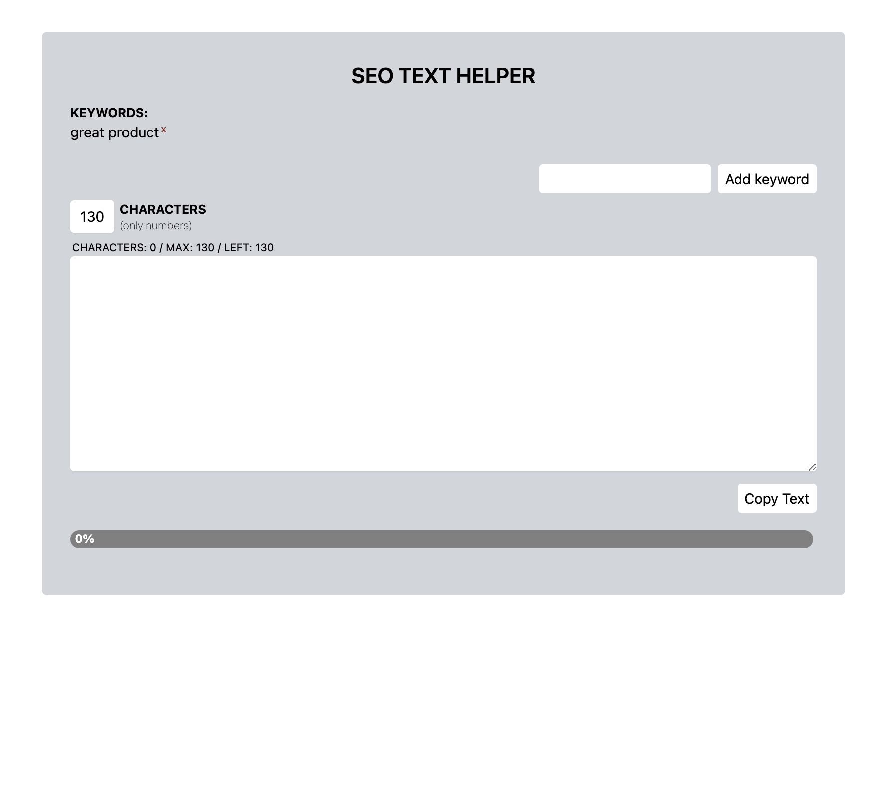

# SEO Text Helper

SEO Text Helper is a React application that assists in optimizing SEO text by providing keyword suggestions and character count tracking. It allows users to add keywords, compare them with the entered text, and provides a progress bar indicating the character count status. The application also offers a "Copy to Clipboard" feature for easy copying of the optimized text.



## Installation

1. Clone the repository to your local machine:

   ```bash
   git clone https://github.com/your-username/seo-text-helper.git
   ```

2. Navigate to the project directory:

   ```bash
   cd seo-text-helper
   ```

3. Install the dependencies:

   ```bash
   npm install
   ```

4. Start the development server:

   ```bash
   npm start
   ```

5. Open your web browser and visit `http://localhost:3000` to access the application.

## Usage

1. Enter the desired keywords in the "Keywords" section. Keywords are case-insensitive, and duplicates will not be added.

2. Add the keywords by either pressing the "Enter" key or clicking the "Add keyword" button.

3. The added keywords will be displayed below the input field.

4. Enter the SEO text in the textarea provided. The character count will update automatically.

5. The progress bar will change color based on the character count. Green indicates a safe range, orange indicates reaching the limit, and red indicates exceeding the limit.

6. Once the SEO text is optimized, click the "Copy to Clipboard" button to copy the text to your clipboard.

7. Paste the copied text in your desired location (e.g., meta description, website content) for optimized SEO.

## Contributing

Contributions are welcome! If you have any suggestions, bug reports, or feature requests, please open an issue or submit a pull request.

## License

This project is licensed under the [MIT License](LICENSE).

```

Please note that you should replace the `https://github.com/your-username/seo-text-helper.git` URL with the correct repository URL for your project.
```
